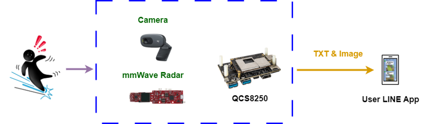

# Qualcomm QCS8250 AI Fall Detection Solution
 
## Advantages of QCS8250
 
1. QCS8250 can provide up to 15 TOPS of AI computing power and supports GPU and DSP accelerated computing
2. The Qualcomm Neural Processing SDK can optimize the performance of trained neural networks
3. It supports Android for AI development

## Performance Metrics
 
- **AI Model**:
  - Human Detection (人形偵測)：Yolov5 (trained on self-collected dataset + CrowdHuman dataset)
  - Fall Determination (跌倒判斷)：Camera BBox aspect-ratio & vertical-drop analysis
- **mmWave Radar Algorithm**:
  - 3D People Counting (TI-provided algorithm) with point-cloud centroid tracking
  - Fall determination based on centroid height drop rate and absolute height threshold
## Hardware
 
- **Platform**: Thundercomm QCS8250 Development Board
- **Radar Sensor**: TI IWR6843 mmWave Radar module
- **Camera**: UVC Camera
## Software & Toolkit
 
- **Development Environment**: Android Studio
- **Python-Android Bridge**: Chaquopy 14.0.2
- **Python Packages**: scipy, requests, numpy
- **Notification Service**: LINE Notify API
- **Model Labeling/Conversion**: LabelImg, Roboflow
## Background & Solution
 
### Motivation
 
Existing single-technology fall detection approaches each have inherent pain points, cameras are affected by occlusion and insufficient lighting, while mmWave Radar alone cannot distinguish people from animals and cannot provide real-time on-scene imagery.
 
### Solution
 
By integrating Camera and mmWave Radar technologies, the two approaches compensate for each other's weaknesses, improving the accuracy and reliability of fall detection.
 

## Architecture Diagram
 
QCS8250 detects a person falling and sends a message together with a real-time image to a LINE Notify group, allowing the user to immediately confirm and respond to the situation.
 

 

## Demo
 
<!-- Add your demo GIF:  -->
<!-- Or MP4: drag assets/demo.mp4 into the GitHub README editor / an Issue, then paste the generated https://github.com/user-attachments/assets/... URL here. -->
https://github.com/user-attachments/assets/2fdafa47-01e3-48e1-831a-c6d9c789ffa2
